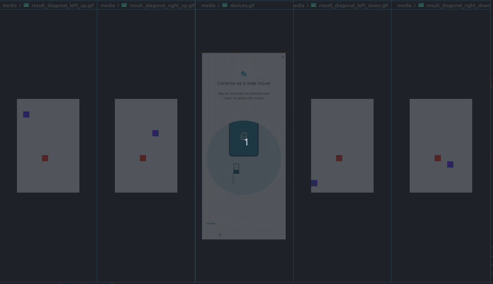
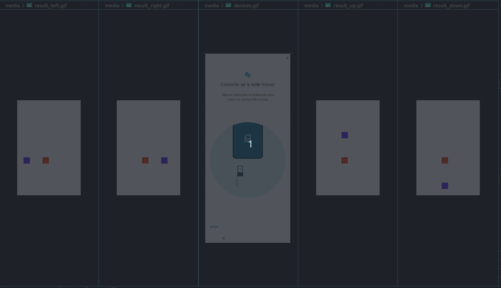
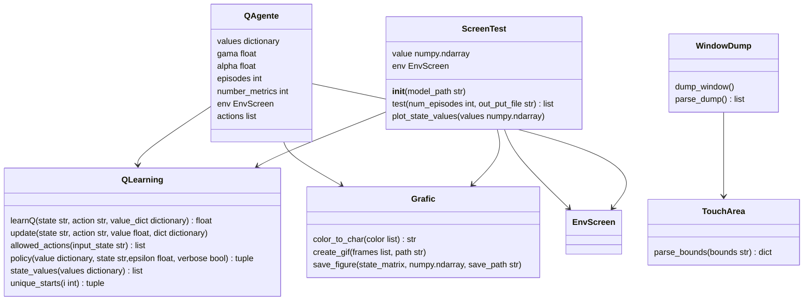
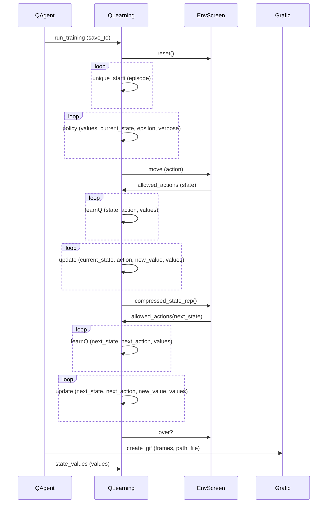
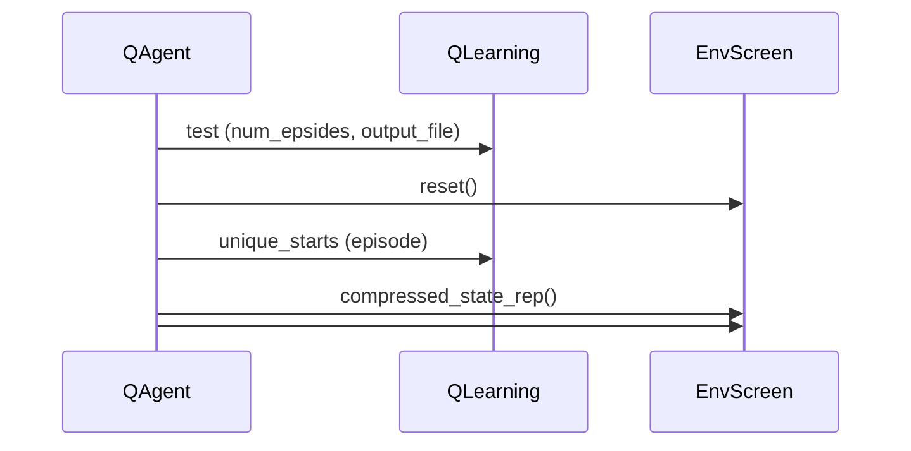

# [IARTES] Reinforcement Learning to Get Device Screen!
This is a Python codebase that includes several classes and functions for a reinforcement learning agent that learns to navigate an environment. The agent learns to navigate from a starting position to a goal position in the grid by updating its Q-values based on the rewards obtained through interactions with the environment. Here's a breakdown of the main components and functionalities:

- `QAgent` class: This class represents the Q-learning agent. It has attributes such as discount factor (`gamma`), learning rate (`alpha`), number of episodes (`episodes`), number of metrics (`number_metrics`), and a list of possible actions (`actions`).
- `run_training` method: This method performs the Q-learning training. It initializes the environment, sets up variables for tracking rewards and steps, and iterates over the specified number of episodes. Within each episode, it selects actions based on the Q-values and updates the Q-values based on the rewards and next states. The rewards and steps per episode are recorded for later analysis.
- `run_test` method: This method runs the trained Q-learning model. It loads the trained Q-values from a file, resets the environment, and applies the learned policy to take actions until the episode is over. Finally, it displays the environment state.
- `run_random` method: This method runs a random agent without any learning. It simply selects random actions until the episode is over.
- `main` block: In the main block, an instance of the `QAgent` class is created. The `run_training` method is called to train the Q-learning agent, followed by the `run_test` method to run the trained model.

    

The code also imports several helper classes and functions (`EnvScreen`, `QLearning`, `Grafic`) from other Python files, which are not included here. These additional files likely contain implementation details for the environment, Q-learning algorithm, and plotting utilities.
Note: The code assumes the existence of a folder named "models" to save the trained model, and it expects the environment to be displayed using the `show_env` method.

    

### Installation

To use this project, follow these steps:

1.  Clone the repository:

`git clone git@github.com:raulbatalha/reinforcement_learning_to_get_device_screen.git`

2.  Navigate to the project directory:

`cd reinforcement_learning_to_get_device_screen`

3.  Install the required dependencies:

`pip install -r requirements.txt`

### Usage

To run the project, execute the `main.py` file:

    python3 src/main.py

This will start the training process of the Q-learning algorithm in the grid world environment. The agent will learn to navigate from the starting position to the goal position by updating its Q-values. The progress will be displayed in the console.
This will display a Matplotlib figure showing the grid world environment with the agent's path.

### Project Structure

The project's directory structure is as follows:

reinforcement_learning_to_get_device_screen/
├── src/
│   ├── main.py
│   ├── environment/
│   │   ├── __init__.py
│   │   └── env_screen.py
│   ├── agent/
│   │   ├── __init__.py
│   │   ├── qlearning.py
│   │   └── qagent.py
│   ├── utils/
│   │   ├── __init__.py
│   │   ├── capture_screen.py
│   │   ├── test_screen.py
│   │   └── util.py
├── data/
│   ├── files/
│   └── models/
├── media/
├── docs/
│   └── README.md
├── tests/
│   ├── __init__.py
│   └── test_environment.py
│   └── test_agent.py
│   └── test_utils.py
├── requirements.txt
└── setup.py

- `env_screen.py`: Contains the implementation of the `Environment` class, representing the grid world environment.
- `main.py`: Entry point of the project. Executes the Q-learning algorithm in the grid world environment.
- `qlearning.py`: Implements the Q-learning algorithm.
- `qagent.py`: Provides functions for visualizing the environment and the agent's path.
- `requirements.txt`: Contains the required dependencies for the project.
- `README.md`: Documentation and information about the project.

# Extension Python Files

### qagent.py

- This file contains the QAgent class, which represents the reinforcement learning agent. The agent uses Q-learning algorithm to learn the optimal policy for navigating the environment. The agent takes several parameters such as gamma, alpha, episodes, number_metrics, and actions in its constructor. The run_training method trains the agent by interacting with the environment for a specified number of episodes. The trained Q-values are saved to a file using pickle. The plot_state_values method plots the state values of the learned policy.

### qlearning.py

- This file contains the QLearning class, which implements the Q-learning algorithm. The class includes several static methods such as learnQ, update, allowed_actions, policy, state_values, and unique_starts that are used by the QAgent class to perform Q-learning.

### env_screen.py

- This file contains the EnvScreen class, which represents the environment in which the agent operates. The environment has a grid-like structure with cells representing different states. The class includes methods for moving the agent, updating the state representation, and resetting the environment.

### util.py

- This file contains utility functions used by the other classes. It includes functions for creating GIF animations, saving figures, parsing XML dumps, and parsing touch areas from bounds.

### main.py

- This file contains an example usage of the codebase. It demonstrates how to train the agent and test its performance in the environment.

To use the codebase, you can import the classes and functions from the respective files and create instances of the QAgent, EnvScreen, and ScreenTest classes to train and test the agent.

## Environment Class

- This class represents the environment in which the agent operates. It provides methods for initializing the environment, performing actions, and updating the state.

### Constructor

` def  __init__(self, size=5, start=(0, 0), goal=(4, 4))`

- `size`: Size of the environment grid (default: 5)
- `start`: Starting position of the agent (default: (0, 0))
- `goal`: Goal position of the agent (default: (4, 4))

### Methods

#### reset

` def reset(self)`

This method resets the environment to its initial state. It sets the agent's position to the starting position.

#### step

` def  step(self, action)`

- `action`: Action to be performed by the agent

This method performs the specified action in the environment. It updates the agent's position based on the action and returns the new state, reward, and episode completion status.

#### get_state_representation

`def  get_state_representation(self)`

This method returns a representation of the current state of the environment. It can be used to encode the state as input for the Q-learning algorithm.

#### is_valid_position (static method

`@staticmethod  def  is_valid_position(position, size)`

- `position`: Position to check
- `size`: Size of the environment grid

This static method checks if a given position is valid within the environment grid.

#### is_goal_state (static method)

`@staticmethod  def  is_goal_state(position, goal)`

- `position`: Position to check
- `goal`: Goal position

This static method checks if a given position is the goal state.

## Visualization Functions

The code also includes utility functions for visualizing the environment and the agent's path.

### visualize_environment

`def visualize_environment(env, ax=None)`

- `env`: Environment instance
- `ax`: Matplotlib axes to plot the environment (optional)

This function visualizes the environment as a grid of cells using Matplotlib. It can be used to display the initial state of the environment.

### visualize_agent_path

`def  visualize_agent_path(env, agent_path, ax=None)`

- `env`: Environment instance
- `agent_path`: List of positions representing the agent's path
- `ax`: Matplotlib axes to plot the environment (optional)

This function visualizes the agent's path in the environment as a series of arrows using Matplotlib. It can be used to display the agent's path during training.

### create_animation

`def create_animation(env, agent_path, filename='agent_path.gif')`

- `env`: Environment instance
- `agent_path`: List of positions representing the agent's path
- `filename`: Filename to save the GIF animation (default: 'agent_path.gif')

This function creates a GIF animation of the agent's path in the environment using Matplotlib and saves it to a file. It can be used to visualize the agent's path after training.

## UML diagrams

You can render UML diagrams using [Mermaid](https://mermaidjs.github.io/). For example, this will produce a sequence diagram:

### Class Diagram

### Sequence Diagram of the Class QAgent

### Sequence Diagram of the Class ScreenTest

## Authors

  - **Raul Batalha** - *Computer Engineering* -
    - [raul.batalha@hotmail.com](raul.batalha@hotmail.com)
    - [Linkedin](https://br.linkedin.com/in/raulbatalha)

## Contributing

1. Fork it ([Fork](https://github.com/raulbatalha/reinforcement_learning_to_get_device_screen/fork))
2. Create your feature branch (`git checkout -b feature/developer`)
3. Commit your changes (`git commit -am '[developer] Add some fooBar'`)
4. Push to the branch (`git push origin feature/developer`)
5. Create a new Pull Request

## [LICENSE.md](https://github.com/raulbatalha/reinforcement_learning_to_get_device_screen/blob/main/LICENSE)

MIT © [Raul Batalha ](https://github.com/raulbatalha)
